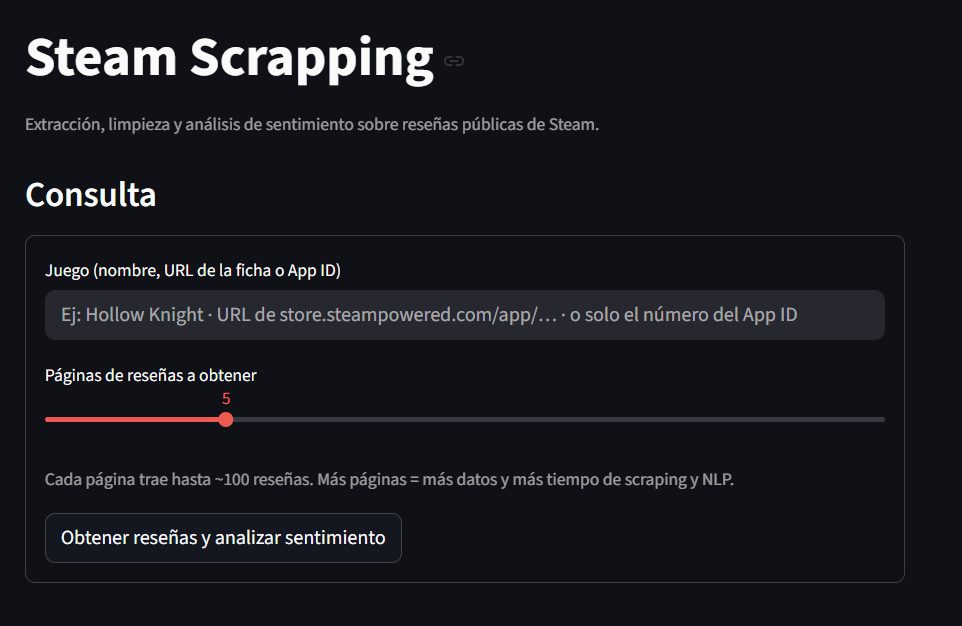
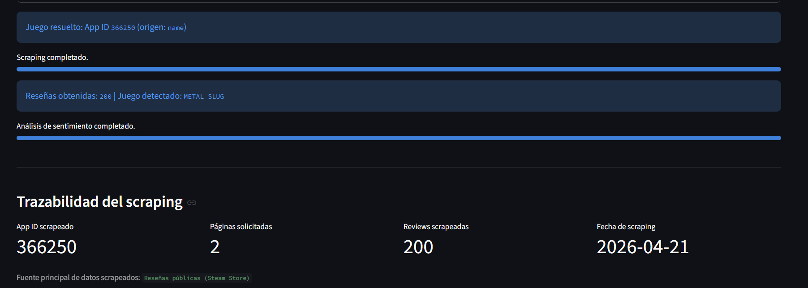
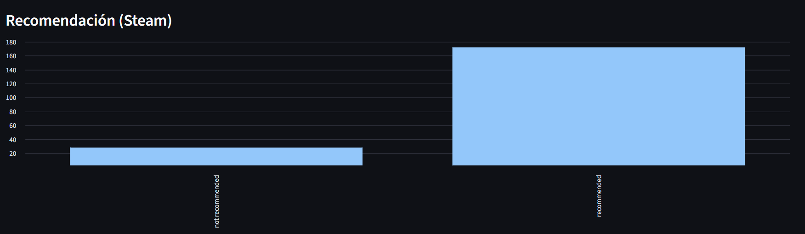
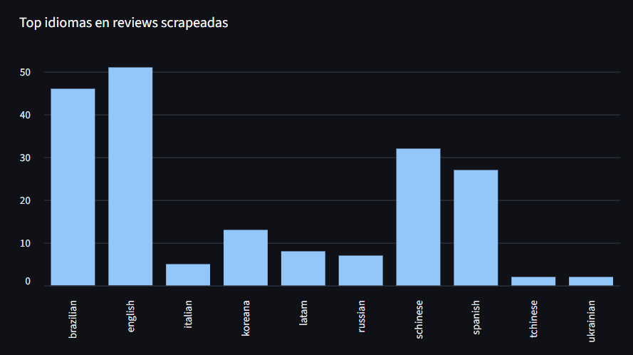
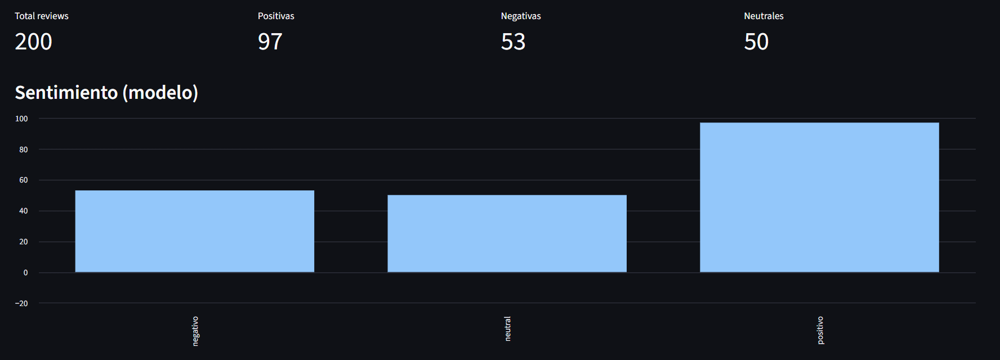
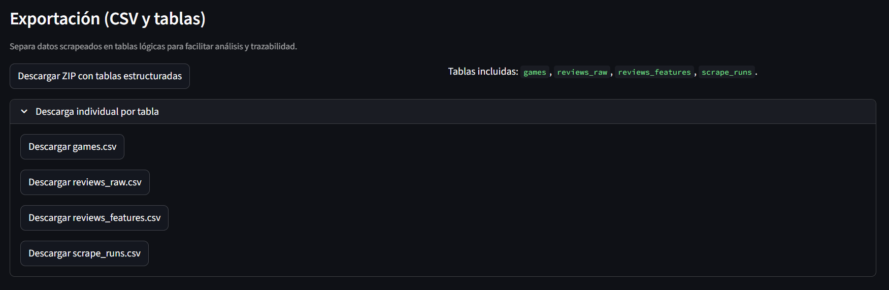

<div align="center">

# 🎮 Steam Scrapping

**Trabajo Académico — Parte 2: Web scraping y análisis de sentimiento**

*Integrantes: Erik Flores • Cristian González • Klever Barahona*

</div>

---

> **📌 Descripción del Proyecto:**  
> Aplicación en **Python + Streamlit** que permite ingresar el **nombre del juego**, una **URL de la ficha en Steam** o el **App ID**, extraer **reseñas públicas** mediante web scraping (HTTP + parseo), **limpiar y procesar** los datos, aplicar **análisis de sentimiento** con un modelo de Hugging Face y **exportar** resultados a **CSV** y a **tablas normalizadas** (ZIP tipo base de datos), con métricas y gráficos en pantalla.

### 🎯 Características principales

* **Resolución flexible del juego:** búsqueda por nombre, lectura de URL de la tienda o `app_id` directo.
* **Scraping híbrido:** datos estructurados de la API de reseñas + enriquecimiento con **BeautifulSoup** cuando el HTML trae campos adicionales.
* **Procesamiento y calidad:** limpieza de texto, métricas del dataset (vacíos, duplicados, fechas) y columnas derivadas.
* **NLP (sentimiento):** inferencia por lotes con `transformers` + `torch`; etiquetas **positivo / neutral / negativo** y *score* de confianza.
* **Age gate:** manejo de verificación de edad de Steam con sesión y reintento cuando aplica.
* **Exportación:** CSV completo + ZIP con `games`, `reviews_raw`, `reviews_features`, `scrape_runs`.

---

## 🚀 Ejecución Local

<details open>
<summary><b>1. 🐍 Entorno y dependencias (PowerShell)</b></summary>
<br>

```powershell
python -m venv .venv
.\.venv\Scripts\Activate.ps1
pip install -r requirements.txt
```

El proyecto declara dependencias extra del tokenizer y del entorno (`sentencepiece`, `tiktoken`, `torchvision`) para evitar errores típicos al cargar el modelo con `transformers`.

</details>

<details open>
<summary><b>2. ▶️ Lanzar la interfaz (Streamlit)</b></summary>
<br>

```powershell
streamlit run app.py
```

**URL local:** [http://localhost:8501](http://localhost:8501)

> [!NOTE]  
> La **primera vez** que se ejecuta el análisis de sentimiento puede tardar más porque Hugging Face **descarga el modelo**; las siguientes corridas suelen reutilizar la caché local.

</details>

<details>
<summary><b>👀 Ver estructura base del repositorio</b></summary>
<br>

```text
app.py
resolver.py
scraper.py
cleaner.py
processor.py
sentiment.py
utils.py
requirements.txt
README.md
.streamlit/config.toml
docs/screenshots/
docs/Datos/
```

</details>

---

## 📤 Salidas y datos de ejemplo

**Desde la app:** descarga de `steam_reviews_sentiment.csv` (tabla ancha) y/o ZIP `steam_reviews_structured_tables.zip` con `games.csv`, `reviews_raw.csv`, `reviews_features.csv`, `scrape_runs.csv`.

**En el repo (`docs/Datos/`):** Misma forma de tablas, de una corrida de referencia, para revisar el esquema sin levantar Streamlit.

| Archivo | Enlace |
|---------|--------|
| `games.csv` | [docs/Datos/games.csv](docs/Datos/games.csv) |
| `reviews_raw.csv` | [docs/Datos/reviews_raw.csv](docs/Datos/reviews_raw.csv) |
| `reviews_features.csv` | [docs/Datos/reviews_features.csv](docs/Datos/reviews_features.csv) |
| `scrape_runs.csv` | [docs/Datos/scrape_runs.csv](docs/Datos/scrape_runs.csv) |

---

## 🧪 Modelo de sentimiento

* **Modelo:** [`cardiffnlp/twitter-xlm-roberta-base-sentiment`](https://huggingface.co/cardiffnlp/twitter-xlm-roberta-base-sentiment)  
* **Uso en el proyecto:** clasificación del **texto del comentario**; la **recomendación** (pulgar arriba/abajo) viene de Steam y se contrasta con el NLP en la app.

---

## 🛡️ Age gate (Steam)

En títulos con restricción de edad, Steam puede mostrar una pantalla intermedia. El scraper intenta detectarla, mantener cookies y continuar el flujo; si no es posible, la aplicación **muestra el error** y no sigue con datos inconsistentes.

---

## 🧾 Limitaciones

* Steam puede cambiar HTML o el formato de las respuestas; el parseo auxiliar puede dejar de coincidir en el futuro.
* Puede haber reseñas sin texto o muy cortas.
* El modelo de sentimiento no está entrenado solo en reseñas de videojuegos: conviene interpretar resultados con criterio (sesgo de dominio).

---

<div align="center">

## 📸 Parte 2 — Evidencia del proyecto

</div>

A continuación se presenta la **validación visual** de la aplicación Streamlit en local: formulario, resultados, gráficos y exportación, alineado con los requerimientos de la parte de scraping y análisis.

### 1️⃣ Interfaz principal (entrada y parámetros)

Formulario para **nombre / URL / App ID**, selector de **páginas de reseñas** y botón de ejecución del pipeline (scraping + NLP).

<table>
<tr>
  <td align="center"><b>Vista principal — Steam Scrapping (Streamlit)</b></td>
</tr>
<tr>
  <td></td>
</tr>
</table>

### 2️⃣ Resultados, trazabilidad y calidad del dataset

Métricas del run (App ID, páginas, cantidad de reviews, fecha de scraping), muestra de datos crudos, indicadores de calidad y tabla de resultados procesados.

<table>
<tr>
  <td align="center"><b>Métricas, muestra cruda, calidad y tabla completa</b></td>
</tr>
<tr>
  <td></td>
</tr>
</table>

### 3️⃣ Gráficos y distribuciones

Visualizaciones generadas en la misma sesión (evolución temporal, barras de idiomas / fuentes, u otras vistas según columnas disponibles).

<table>
<tr>
  <td align="center"><b>Gráfico 1</b></td>
</tr>
<tr>
  <td></td>
</tr>
<tr>
  <td align="center"><b>Gráfico 2</b></td>
</tr>
<tr>
  <td></td>
</tr>
<tr>
  <td align="center"><b>Gráfico 3</b></td>
</tr>
<tr>
  <td></td>
</tr>
</table>

### 4️⃣ Exportación (CSV y ZIP estructurado)

Botones de descarga del **CSV consolidado** y del **ZIP** con tablas tipo base de datos.

<table>
<tr>
  <td align="center"><b>Descarga de artefactos desde la app</b></td>
</tr>
<tr>
  <td></td>
</tr>
</table>

---

## 🔗 Referencias rápidas

* [Modelo Cardiff NLP (Hugging Face)](https://huggingface.co/cardiffnlp/twitter-xlm-roberta-base-sentiment)  
* [Documentación Streamlit](https://docs.streamlit.io)  
* [Documentación pandas](https://pandas.pydata.org/docs/)  

---
